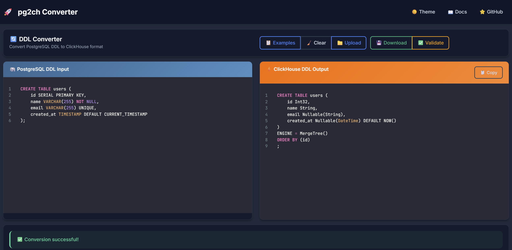

# pg2ch - PostgreSQL to ClickHouse DDL Converter

[](https://badge.fury.io/py/pg2ch)
[](https://opensource.org/licenses/Apache-2.0)

> **Effortlessly migrate your PostgreSQL schemas to ClickHouse** 🔄

Convert PostgreSQL DDL statements to ClickHouse format with intelligent type mapping, constraint handling, and schema
optimization. Perfect for data migrations, analytics workflows, and multi-database architectures.

## Features

- 🎯 **Smart Type Mapping** - Automatic PostgreSQL → ClickHouse type conversion
- 🔑 **Primary Key Detection** - Generates optimal `ORDER BY` clauses
- 🛡️ **Constraint Handling** - Preserves `NOT NULL`, `UNIQUE`, `DEFAULT` values
- 📝 **Schema Support** - Handles `public.table` notation seamlessly
- 🔧 **CLI Interface** - Batch process multiple DDL files
- ✅ **DDL Validation** - Optional syntax validation with ClickHouse Local
- 📊 **Metadata Extraction** - Detailed table and column information

## 🚀 Quick Start

### Installation

```bash
pip install pg2ch
```

### Basic Usage

```python
from pg2ch import convert_ddl

# Define the PostgreSQL DDL as a string
postgres_ddl = """
CREATE TABLE IF NOT EXISTS public.transactions (
    transaction_id    BIGSERIAL PRIMARY KEY,
    user_id           INTEGER NOT NULL,
    account_id        INTEGER NOT NULL,
    transaction_type  VARCHAR(20) NOT NULL,
    amount            DECIMAL(15,2) NOT NULL,
    currency          CHAR(3) DEFAULT 'USD',
    description       TEXT,
    created_at        TIMESTAMP WITH TIME ZONE DEFAULT CURRENT_TIMESTAMP
);
"""

# Convert the PostgreSQL DDL to ClickHouse DDL
clickhouse_ddl = convert_ddl(postgres_ddl)

# Print the resulting ClickHouse DDL
print("--- PostgreSQL DDL ---")
print(postgres_ddl)
print("\n--- Converted ClickHouse DDL ---")
print(clickhouse_ddl)
```

**Output:**

```sql
--- PostgreSQL DDL ---
CREATE TABLE IF NOT EXISTS public.transactions
(
    transaction_id   BIGSERIAL PRIMARY KEY,
    user_id          INTEGER NOT NULL,
    account_id       INTEGER NOT NULL,
    transaction_type VARCHAR(20) NOT NULL,
    amount           DECIMAL(15, 2) NOT NULL,
    currency         CHAR(3) DEFAULT 'USD',
    description      TEXT,
    created_at       TIMESTAMP WITH TIME ZONE DEFAULT CURRENT_TIMESTAMP
);

--- Converted ClickHouse DDL ---
CREATE TABLE IF NOT EXISTS transactions
(
    transaction_id   Int64,
    user_id          Int32,
    account_id       Int32,
    transaction_type String,
    amount           Decimal64(4),
    currency         Nullable(String)   DEFAULT 'USD',
    description      Nullable(String),
    created_at       Nullable(DateTime) DEFAULT NOW()
)
    ENGINE = MergeTree()
        ORDER BY (transaction_id);
```

# 🐳 pg2ch-UI Quick Start Guide


Easy-to-use Docker setup for the pg2ch PostgreSQL to ClickHouse DDL converter web interface.



## 🚀 Quick Start (Recommended)

The fastest way to get pg2ch running:

```bash
# 1. Clone or download the project
git clone https://github.com/GujaLomsadze/pg2ch.git
cd pg2ch

# 2. Start the application
docker-compose up -d

# 3. Open your browser
open http://localhost:5003
```
## 🚀 Quick Start (Easier (If you are on Linux))

```bash
./start.sh
```

That's it! The web interface will be available at `http://localhost:5003`.

##  For more details about UI, please check `web-ui/README.md`


---

## 🎯 Advanced Usage

### Parse and Inspect Metadata

```python
...

parser = PostgreSQLParser()
tables = parser.parse_ddl(postgres_ddl)

for table in tables:
    # table.to_json()
    # table.to_dict()
    # table.print_json()
    # table.get_column()

    # Access individual table properties
    print(f"Table: {table.name}")
    print(f"Columns: {len(table.columns)}")
    print(f"Primary Keys: {table.primary_keys}")
```

### CLI Usage

```bash
# Convert a single file
pg2ch schema.sql

# Save to output file
pg2ch schema.sql --output clickhouse_schema.sql

# With validation (requires clickhouse-local)
pg2ch schema.sql --validate
```

### DDL Validation

```python
from pg2ch import convert_ddl, validate_clickhouse_ddl_with_local

postgres_ddl = """
CREATE TABLE IF NOT EXISTS public.transactions (
    transaction_id    BIGSERIAL PRIMARY KEY,
    user_id           INTEGER NOT NULL,
    account_id        INTEGER NOT NULL,
    transaction_type  VARCHAR(20) NOT NULL,
    amount            DECIMAL(15,2) NOT NULL,
    currency          CHAR(3) DEFAULT 'USD',
    description       TEXT,
    created_at        TIMESTAMP WITH TIME ZONE DEFAULT CURRENT_TIMESTAMP
);

"""

""" Run with 'validate=True' """

clickhouse_ddl = convert_ddl(postgres_ddl, validate=True)

""" or, use function """

is_valid, message = validate_clickhouse_ddl_with_local(clickhouse_ddl)
print(message)  # ✅ DDL is valid

```

## 📋 Type Mapping Reference

| PostgreSQL                 | ClickHouse     | Notes                     |
|----------------------------|----------------|---------------------------|
| `SERIAL`                   | `Int32`        | Auto-increment            |
| `BIGSERIAL`                | `Int64`        | Large auto-increment      |
| `VARCHAR(n)`               | `String`       | Variable length text      |
| `TEXT`                     | `String`       | Unlimited text            |
| `INTEGER`                  | `Int32`        | 32-bit integer            |
| `BIGINT`                   | `Int64`        | 64-bit integer            |
| `BOOLEAN`                  | `Bool`         | True/false values         |
| `DECIMAL(p,s)`             | `Decimal64(4)` | Fixed precision           |
| `TIMESTAMP`                | `DateTime`     | Date and time             |
| `TIMESTAMP WITH TIME ZONE` | `DateTime`     | Timezone-aware timestamps |
| `JSONB`                    | `String`       | JSON data as string       |
| `UUID`                     | `String`       | UUID as string            |

## 🧪 Testing

```bash
# Run all tests
pytest

# Run with coverage
pytest --cov=pg2ch

# Run specific test
pytest tests/test_transactions_table.py -v
```

## 📚 Documentation

- **[API Reference](docs/api.md)** - Detailed API documentation
- **[Usage Guide](docs/usage.md)** - Advanced usage patterns
- **[Contributing](docs/contributing.md)** - Development guidelines
- **[Changelog](CHANGELOG.md)** - Version history

## 📈 Roadmap

- [ ] **Foreign Key Support** - Convert foreign key constraints
- [ ] **Index Migration** - Transform PostgreSQL indexes
- [ ] **Partitioning Support** - Migrate table partitioning schemes
- [ ] **GUI Interface** - Web-based conversion tool

## 🐛 Known Limitations

- Complex constraints (CHECK with subqueries) are simplified
- PostgreSQL-specific functions may need manual adjustment
- Some advanced PostgreSQL types require custom mapping

## 📄 License

This project is licensed under the Apache License 2.0 - see the [LICENSE](LICENSE) file for details.

---

<div align="center">

**Made with ❤️ for the data engineering community**

[⭐ Star on GitHub](https://github.com/GujaLomsadze/pg2ch) • [🐛 Report Bug](https://github.com/GujaLomsadze/pg2ch/issues)

</div>
