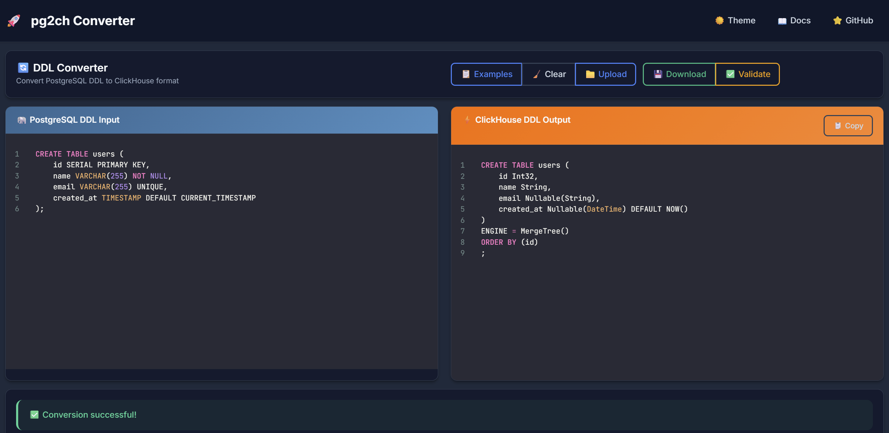

# 🐳 pg2ch-UI Docker Quick Start Guide


Easy-to-use Docker setup for the pg2ch PostgreSQL to ClickHouse DDL converter web interface.



## 🚀 Quick Start (Recommended)

The fastest way to get pg2ch running:

```bash
# 1. Clone or download the project
git clone https://github.com/GujaLomsadze/pg2ch.git
cd pg2ch

# 2. Start the application
docker-compose up -d

# 3. Open your browser
open http://localhost:5003
```
## 🚀 Quick Start (Easier (If you are on Linux))

```bash
./start.sh
```

That's it! The web interface will be available at `http://localhost:5003`.

## 🛠️ Available Commands

### Basic Usage
```bash
# Start the application (detached mode)
docker-compose up -d

# Start with logs visible
docker-compose up

# Stop the application
docker-compose down

# View logs
docker-compose logs -f pg2ch-web

# Restart the application
docker-compose restart

# Check status
docker-compose ps
```

### Production Mode
For production deployment with nginx reverse proxy:

```bash
# Start with nginx reverse proxy
docker-compose --profile production up -d

# This will start:
# - pg2ch-web on port 5003 (internal)
# - nginx on port 80 (public)
```

### Development Mode
```bash
# Build and start for development
docker-compose up --build

# Force rebuild
docker-compose build --no-cache
docker-compose up -d
```

## 🔧 Configuration Options

### Environment Variables
Create a `.env` file to customize settings:

```bash
# .env
FLASK_ENV=production
SECRET_KEY=your-super-secret-key-here
DEBUG=False
HOST=0.0.0.0
PORT=5003

# Optional: Enable ClickHouse validation
ENABLE_CLICKHOUSE_VALIDATION=true
```

### Port Configuration
To run on a different port:

```bash
# Edit docker-compose.yml ports section:
ports:
  - "8080:5003"  # Run on port 8080 instead of 5003
```

### Volume Mounts
The compose file includes optional volume mounts:

```yaml
volumes:
  - ./uploads:/app/static/uploads  # Persist uploaded files
  - ./logs:/app/logs              # Persist application logs
```

## 🏗️ Build Options

### Standard Build
```bash
# Build the image
docker build -t pg2ch-web .

# Run the container
docker run -p 5003:5003 pg2ch-web
```

### With ClickHouse Local (for validation)
To enable DDL validation, uncomment the ClickHouse installation lines in the Dockerfile:

```dockerfile
# Uncomment these lines in Dockerfile:
RUN curl https://clickhouse.com/ | sh
RUN chmod +x ./clickhouse
RUN mv ./clickhouse /usr/local/bin/clickhouse-local
```

Then rebuild:
```bash
docker-compose build --no-cache
docker-compose up -d
```

## 🔍 Troubleshooting

### Check if the service is running
```bash
# Check container status
docker-compose ps

# Check container logs
docker-compose logs pg2ch-web

# Check health status
curl http://localhost:5003/api/health
```

### Common Issues

**Port already in use:**
```bash
# Find what's using port 5003
lsof -i :5003

# Or change the port in docker-compose.yml
ports:
  - "5001:5003"
```

**Permission issues:**
```bash
# Fix file permissions
sudo chown -R $USER:$USER ./uploads
```

**Build fails:**
```bash
# Clean build
docker-compose down
docker system prune -f
docker-compose build --no-cache
```

## 📊 Health Monitoring

The application includes a health check endpoint:

```bash
# Manual health check
curl http://localhost:5003/api/health

# Docker health status
docker-compose ps
```

## 🔒 Security Notes

For production deployment:

1. **Change the secret key** in `.env` or `docker-compose.yml`
2. **Use HTTPS** by configuring SSL certificates in nginx
3. **Restrict access** using firewall rules or nginx auth
4. **Regular updates** of the Docker image

## 📝 File Structure

```
pg2ch/
├── Dockerfile              # Main application container
├── docker-compose.yml      # Service orchestration
├── .dockerignore           # Files to exclude from build
├── nginx.conf              # nginx configuration (production)
├── .env.example            # Environment variables template
├── src/                    # pg2ch Python package
├── web-ui/                 # Web interface code
└── uploads/                # Uploaded files (created at runtime)
```
---

**Made with ❤️ for the data engineering community**
